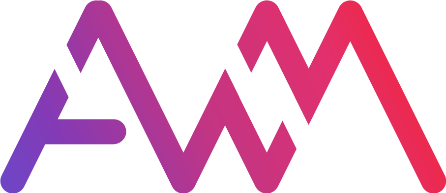

<a href="https://awmium.com"></a>

`❯ awmium/about`

## From design, to data, to *agents*.

I’m Azmir Murad, an analytics engineer in Dhaka, Bangladesh. I translate: someone asks a question, and I turn it into a number they can trust, designed so it is understood at a glance.

I work the whole stack: the report, Power BI, the semantic model and Microsoft Fabric underneath. Now there is a new layer on top: I write the contract, an agent writes the code, and a test proves every number before anyone sees it.

```text
❯ ls ~/now
design/          report design systems, app interfaces, brand
fabric-apps/     data apps inside Microsoft Fabric, built with Rayfin
agentic-dev/     I write the contract, an agent builds, tests prove the numbers
data-agents/     Fabric data agents that answer in plain language
agent-kit/       skills and small tools for working with Claude Code
```

[awmium.com](https://awmium.com) · [portfolio](https://awmium.com/portfolio) · [blog](https://awmium.com/blog) · [agent-kit](https://awmium.com/agent-kit) · [linkedin](https://www.linkedin.com/in/awmium/) · [hello@awmium.com](mailto:hello@awmium.com)
